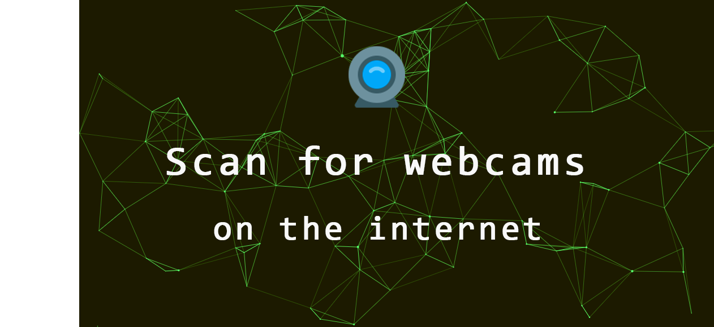

# scan-for-webcams :camera:

[中文文档](/zh/README.md)

## Table of contents

- [Usage](#Usage)
- [Installation](#Installation)
- [Demo](#Demo)

## Usage

* ` sfw search MJPG` : for public [MJPG streamers](https://github.com/jacksonliam/mjpg-streamer)

* ` sfw search webcamXP` : for public [webcamXP streamers](http://www.webcamxp.com/)

* `sfw search yawCam`: for public [yawCam steamers](https://www.yawcam.com/)

* ` sfw search --help`: for more options and help

The program will output a list of links with the format of `ip_address:port`, and descriptions of the image beneath it.

If your terminal supports links, click the link and open it in your browser, otherwise, copy the link and open it in your browser.

## Installation

1. install package from PYPI:
   `pip install scan-for-webcams`

2. set up shodan:
   go to [shodan.io](https://shodan.io), register/log in and grab your API key

3. set up clarifai:
   go to [clarifai.com](https://clarifai.com), register/log in, create an application and grab your API key
   
4. Add API keys:
   1. run `sfw setup`
   2. enter your shodan and clarifai API keys

And then you can run the program!

## Demo

